Berikut laporan **Jobsheet 16 (Deployment Next.js ke Vercel)** dalam format **Markdown (MD)** dengan struktur dan gaya penulisan yang sudah disesuaikan **persis seperti laporan sebelumnya**, serta sudah mencantumkan **seluruh langkah dan modifikasi** secara sistematis.

---

# PEMROGRAMAN BERBASIS FRAMEWORK

## JOBSHEET 20

### Deployment Aplikasi Next.js ke Vercel

---

## 👤 Identitas Mahasiswa

* **Nama:** Ghetsa Ramadhani Riska A.
* **Kelas:** TI-3D
* **No. Absen:** 10
* **Program Studi:** Teknik Informatika
* **Jurusan:** Teknologi Informasi
* **Politeknik Negeri Malang**
* **Tahun:** 2026

---

# A. Tujuan Praktikum

Setelah menyelesaikan praktikum ini, mahasiswa mampu:

1. Membuat repository GitHub dan menghubungkannya dengan project lokal
2. Melakukan deployment aplikasi Next.js ke Vercel
3. Mengelola environment variables di Vercel
4. Memahami perbedaan SSG dan SSR saat deployment
5. Mengatasi error build akibat penggunaan localhost API
6. Menghubungkan Google OAuth ke domain production
7. Melakukan redeploy setelah perubahan konfigurasi
8. Menghubungkan aplikasi ke domain production

---

# B. Dasar Teori Singkat

## 1️⃣ Deployment Aplikasi Web

Deployment adalah proses mempublikasikan aplikasi dari lingkungan lokal ke server agar dapat diakses secara online.

Alur deployment:

```text
Project lokal
↓
Push ke GitHub
↓
Import ke Vercel
↓
Build aplikasi
↓
Deploy ke production
↓
Aplikasi dapat diakses publik
```

---

## 2️⃣ Konsep SSG, SSR, dan CSR

| Konsep | Penjelasan                |
| ------ | ------------------------- |
| SSG    | Data diambil saat build   |
| SSR    | Data diambil saat request |
| CSR    | Data diambil di browser   |

---

## 3️⃣ Environment Variable

Environment variable digunakan untuk menyimpan konfigurasi penting seperti URL API.

Contoh:

```text
NEXT_PUBLIC_API_URL
```

Tujuannya:

* Menghindari hardcode URL
* Mempermudah konfigurasi production
* Meningkatkan keamanan

---

## 4️⃣ OAuth Production

OAuth digunakan untuk autentikasi pihak ketiga (misalnya Google Login).
Pada production, perlu konfigurasi:

* Authorized Origin
* Redirect URI

---

# C. Langkah Kerja Praktikum

---

## Bagian 1 – Membuat Repository GitHub

### 1️⃣ Membuat repository baru

Langkah:

1. Login ke GitHub
2. Klik **New Repository**
3. Isi nama repository
4. Pilih Public/Private
5. Klik **Create Repository**

---

### 2️⃣ Konfigurasi Git

Cek konfigurasi:

```bash
git config --global user.name
git config --global user.email
```

Jika belum ada:

```bash
git config --global user.name "username_github"
git config --global user.email "email_github"
```

---

### 3️⃣ Menghubungkan project ke GitHub

Tambahkan remote repository:

```bash
git remote add origin https://github.com/username/repository.git
git add .
git commit -m "Initial deployment"
git push origin main
```

Hasil:

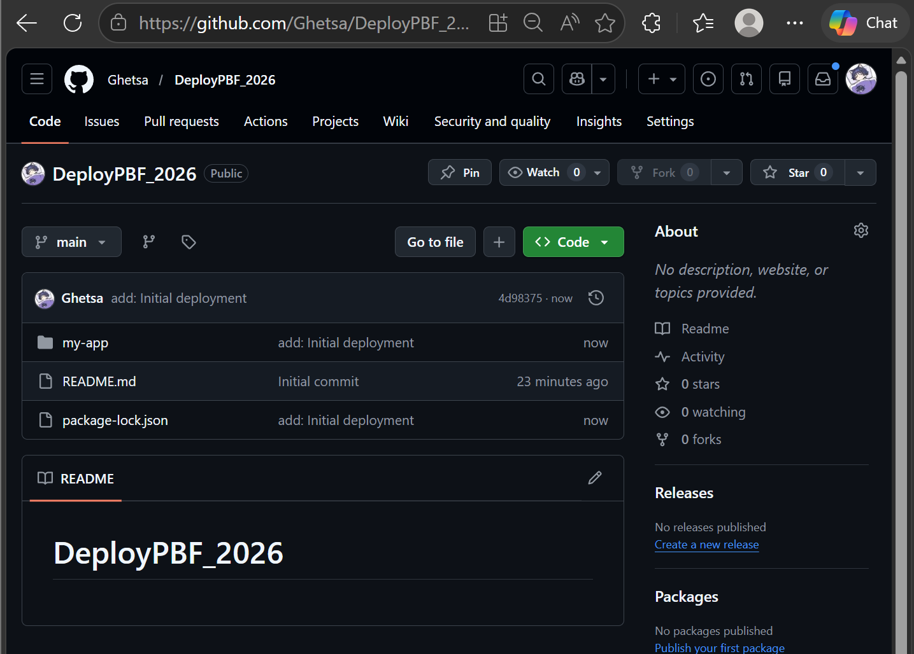

* Project berhasil terupload ke GitHub

---

## Bagian 2 – Deployment ke Vercel

### 1️⃣ Login ke Vercel

Buka:

```text
https://vercel.com
```

Login menggunakan akun GitHub.

---

### 2️⃣ Import project

Langkah:

1. Klik **Add New Project**
2. Install GitHub jika diminta
3. Klik **Import** pada repository

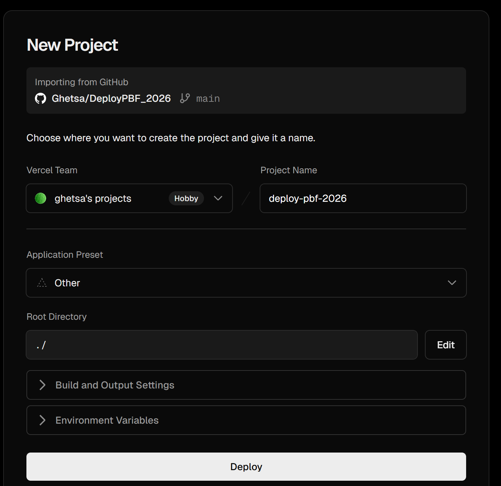

---

### Mengatasi Error Saat Deployment

#### 1️⃣ Masalah: Static Site Generation (SSG) gagal

Penyebab:

* Project masih menggunakan SSG
* API masih menggunakan localhost

---

#### 2️⃣ Modifikasi: Hapus file static

Hapus file:

```text
static.tsx
```

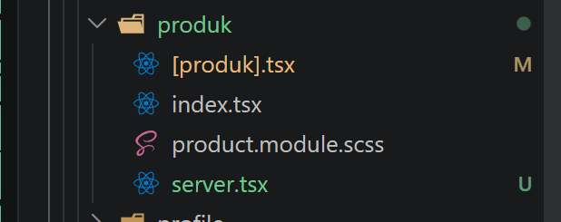

---

#### 3️⃣ Modifikasi: Comment SSG

Buka file:

```text
[produk].tsx
```

Comment bagian SSG (misalnya `getStaticProps` atau `getStaticPaths`).

---

#### 4️⃣ Modifikasi: Gunakan SSR

Aktifkan SSR dengan membuka comment:

```tsx
export async function getServerSideProps() {
  // fetch data
}
```

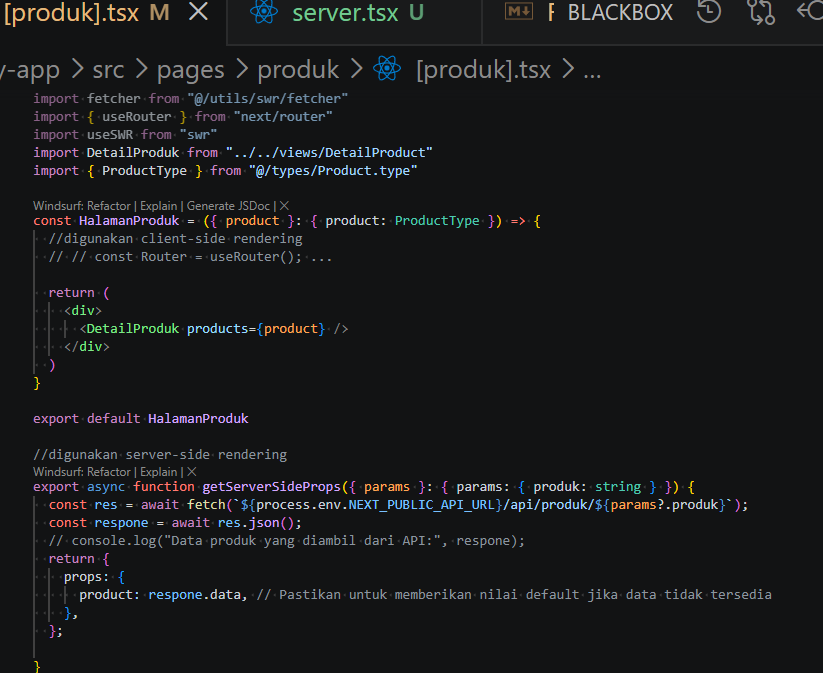

---

#### 5️⃣ Modifikasi: Tambahkan environment variable

Buat file:

```text
.env.local
```

Isi:

```env
NEXT_PUBLIC_API_URL=http://localhost:3000
```

---

#### 6️⃣ Modifikasi: Ganti hardcoded URL

Sebelum:

```ts
fetch("http://localhost:3000/api/product")
```

Sesudah:

```ts
fetch(`${process.env.NEXT_PUBLIC_API_URL}/api/product`)
```

Dilakukan pada:

```text
[produk].tsx
server.tsx
```


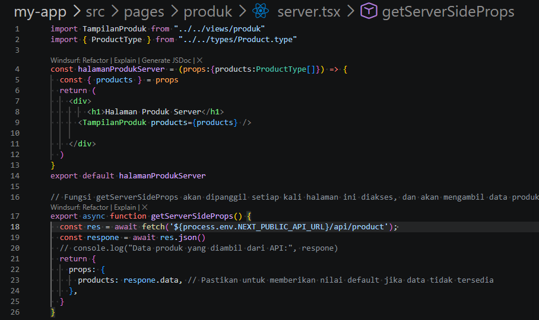

---

#### 7️⃣ Commit ulang

```bash
git add .
git commit -m "fix deployment config"
git push origin main
```

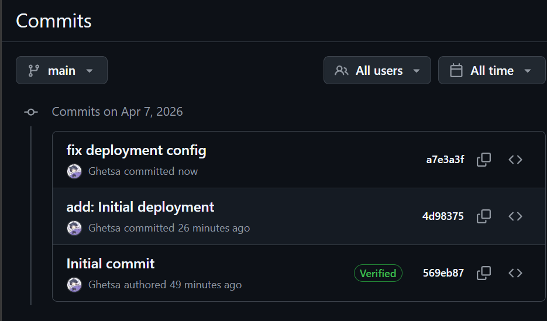


### Import Project ke Vercel

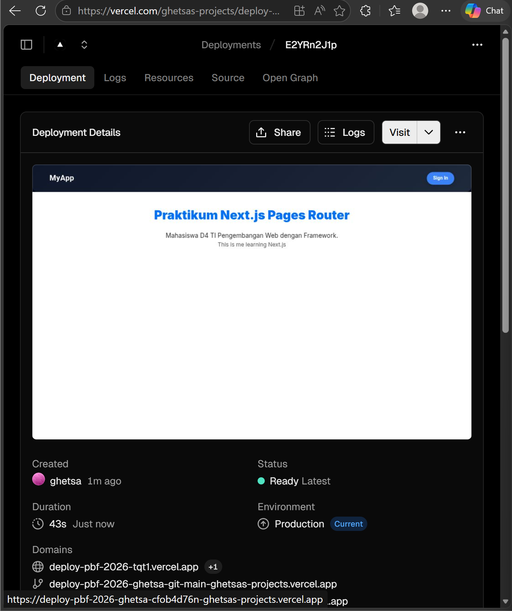

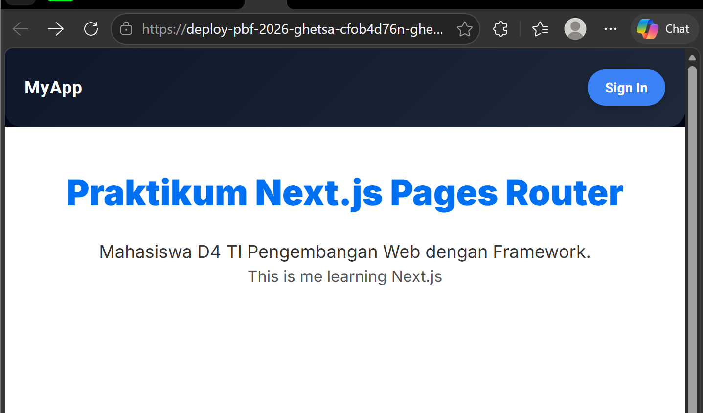

---

## Bagian 3 – Menambahkan Environment Variable di Vercel

### 1️⃣ Buka setting project

Masuk ke:

```text
Settings → Environment Variables
```

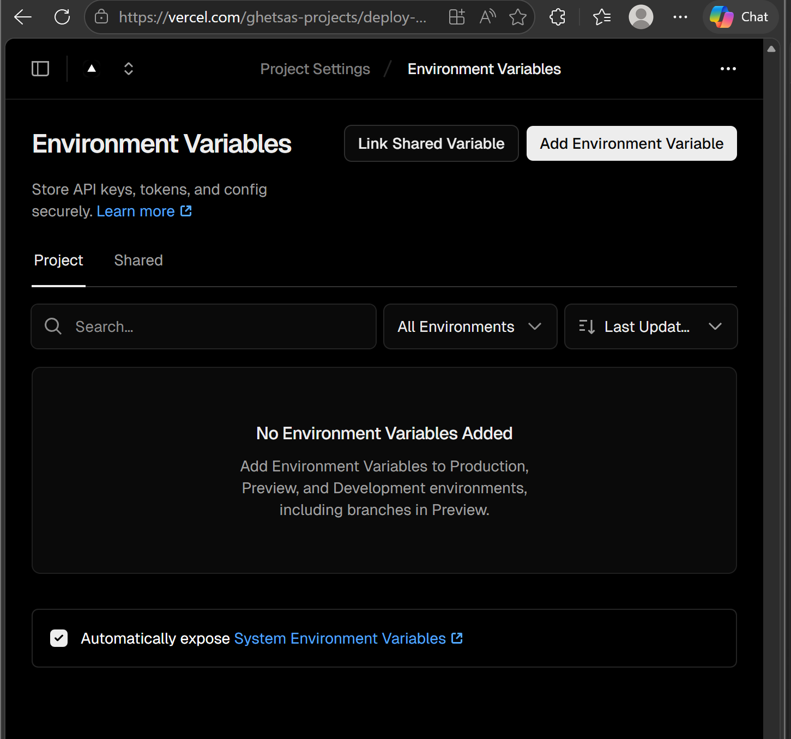

---

### 2️⃣ Import environment

Tambahkan:

```text
NEXT_PUBLIC_API_URL=https://namaproject.vercel.app
```

Catatan:

* Tidak menggunakan "/" di akhir URL

---

### 3️⃣ Redeploy

Langkah:

```text
Deployment → Redeploy
```

---

## Bagian 4 – Konfigurasi Google OAuth Production

### 1️⃣ Masuk ke Google Cloud Console

Langkah:

1. Buka Google Developer Console
2. Pilih **Credentials**
3. Pilih OAuth Client

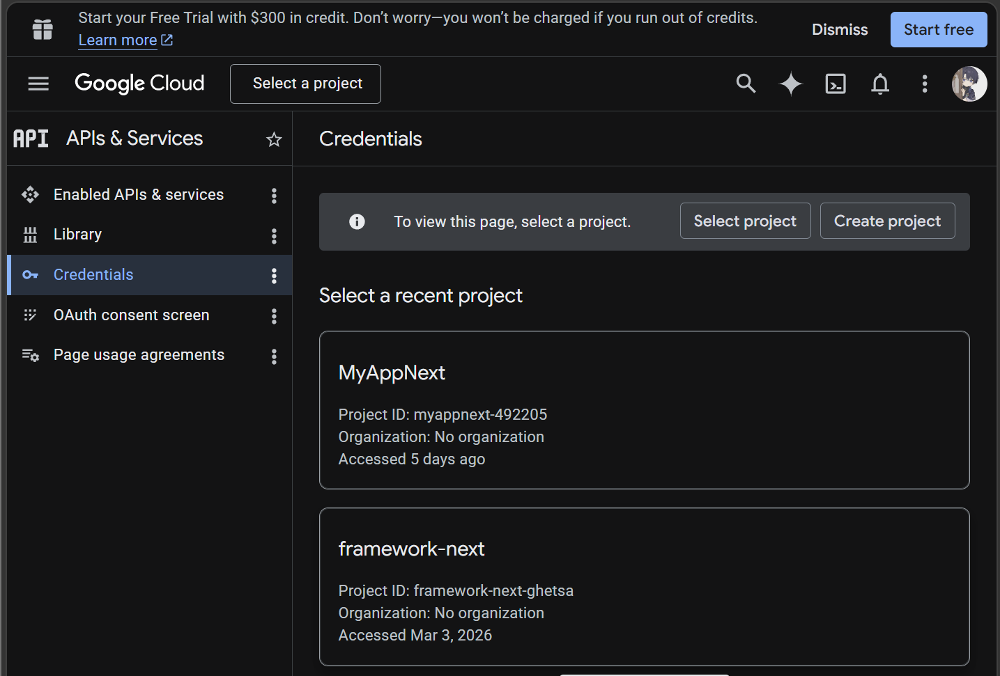

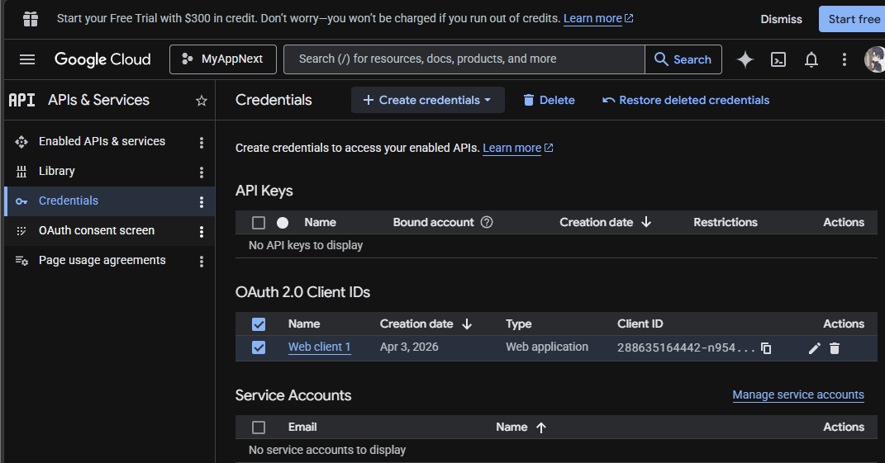

---

### 2️⃣ Tambahkan Authorized Origins

Isi dengan:

```text
https://deploy-pbf-2026.vercel.app
```

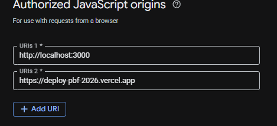

---

### 3️⃣ Tambahkan Redirect URI

Contoh:

```text
https://deploy-pbf-2026.vercel.app/api/auth/callback/google
```

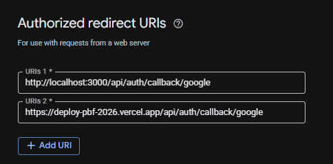

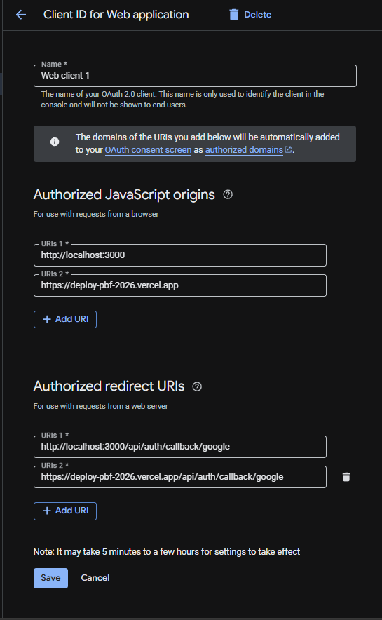

---

### 4️⃣ Modifikasi kode login

File:

```text
views/auth/login/index.tsx
```

Perbaiki bagian konfigurasi login Google agar sesuai dengan domain production.

---

### 5️⃣ Redeploy ulang

Agar konfigurasi terbaca:

```text
Redeploy di Vercel
```

---

## Bagian 6 – Pengujian Deployment

### 1️⃣ Pengujian halaman

Akses:

```text
/
 /about
 /product
 /profile
```

---

### 2️⃣ Pengujian fitur login

Uji:

* Login Google
* Login credential biasa

---

### 3️⃣ Validasi sistem

Pastikan:

* SSR berjalan
* API tidak menggunakan localhost
* Database terkoneksi
* Login Google berhasil

---

# D. Pengujian

## Uji 1 – Deployment Berhasil

Hasil:

* Aplikasi dapat diakses via URL Vercel
* Semua halaman dapat dibuka

---

## Uji 2 – Environment Variable

Hasil:

* API menggunakan URL production
* Tidak ada error localhost

---

## Uji 3 – Login Google

Hasil:

* Login berhasil
* Redirect sesuai konfigurasi

---

## Uji 4 – SSR

Hasil:

* Data berhasil dimuat saat request
* Tidak terjadi error build

---

# E. Tugas Praktikum

1. Deploy project ke Vercel
2. Menghilangkan penggunaan localhost
3. Konfigurasi Google OAuth production
4. Melakukan redeploy minimal 1x
5. Dokumentasi:

   * Screenshot dashboard Vercel
   * URL deployment
   * Screenshot login Google

---

# F. Pertanyaan Analisis

### 1. Mengapa localhost tidak boleh digunakan di production?

Karena localhost hanya berjalan di komputer lokal dan tidak dapat diakses oleh server production, sehingga API akan gagal saat deployment.

---

### 2. Mengapa SSG bisa gagal saat build?

Karena data diambil saat proses build, sehingga jika API tidak dapat diakses (misalnya localhost), proses build akan gagal.

---

### 3. Apa perbedaan SSR dan SSG saat deployment?

SSG mengambil data saat build, sedangkan SSR mengambil data saat request sehingga lebih fleksibel pada production.

---

### 4. Mengapa perlu redeploy setelah menambahkan environment?

Karena perubahan environment variable tidak langsung diterapkan sebelum dilakukan build ulang.

---

### 5. Apa fungsi redirect URI pada OAuth?

Redirect URI digunakan untuk menentukan tujuan setelah proses autentikasi berhasil.

---

# G. Output yang Diharapkan

Mahasiswa menghasilkan:

* Project terhubung ke GitHub
* Aplikasi berhasil deploy di Vercel
* Environment variable berjalan
* API tidak menggunakan localhost
* OAuth production berhasil
* Aplikasi dapat diakses secara online

---

# H. Kesimpulan

Pada praktikum ini telah dipelajari:

* Proses deployment aplikasi Next.js ke Vercel
* Integrasi GitHub dengan Vercel
* Penggunaan environment variable pada production
* Perbedaan SSG dan SSR
* Penanganan error deployment
* Konfigurasi OAuth production
* Proses redeploy aplikasi

Deployment merupakan tahap penting dalam pengembangan aplikasi web karena menentukan apakah aplikasi dapat berjalan dengan baik di lingkungan production. Dengan konfigurasi yang tepat, aplikasi dapat berjalan stabil, aman, dan dapat diakses secara luas.
